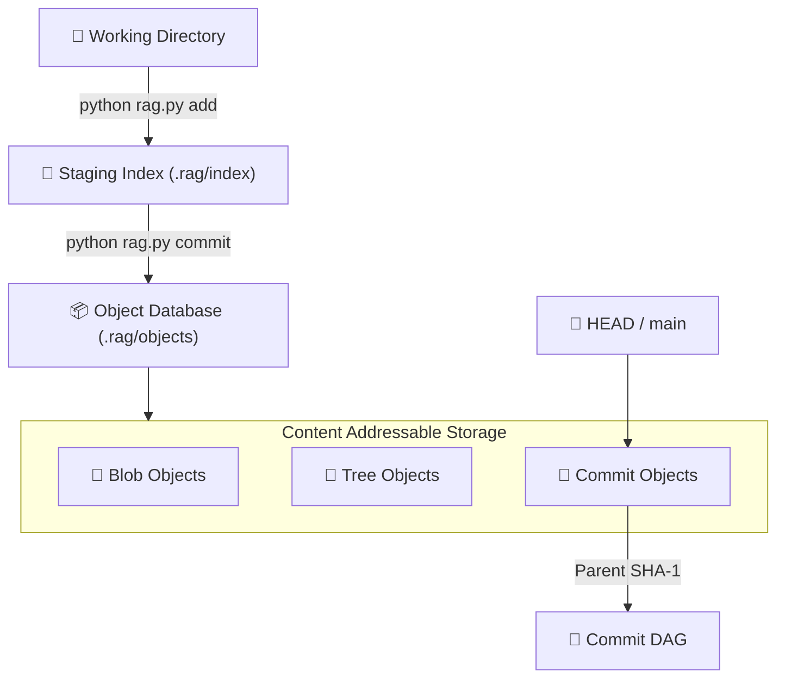

# R.A.G. — Repository Architecture & Graph

[](https://www.python.org/)
[](#)
[](#)
[](#)

A pure Python, zero-dependency implementation of the core mechanics behind Git, built entirely from first principles. **R.A.G.** demonstrates how modern version control systems implement content-addressable storage, staging, immutable snapshots, and commit graphs without relying on external libraries.

---

# ⚙️ Core Architecture

Every tracked file moves through a deterministic pipeline before becoming part of repository history.



---

# 📈 Performance Characteristics

| Operation               | Complexity                           |
| ----------------------- | ------------------------------------ |
| `init`                  | **O(1)**                             |
| `status`                | **O(N)**                             |
| `add` (initial)         | **O(N)**                             |
| `add` (unchanged files) | **Near O(1)**                        |
| `commit`                | **O(1)** relative to repository size |

---

# 🚀 Cold-Disk Benchmark Results

Benchmarks were executed on **Arch Linux** using `benchmark_rag.py` with **OS page cache dropped before every operation**, measuring true filesystem performance rather than warm-cache execution.

| Repository Scale |         `add` |    `commit` |     `status` |
| ---------------: | ------------: | ----------: | -----------: |
|    **100 Files** |  **33.69 ms** | **2.30 ms** |  **3.59 ms** |
|    **500 Files** | **133.13 ms** | **6.05 ms** | **13.41 ms** |
|  **1,000 Files** | **283.41 ms** | **8.39 ms** | **26.53 ms** |

### Peak Memory Usage

| Repository Scale |  `init` |   `add` | `commit` | `status` |
| ---------------: | ------: | ------: | -------: | -------: |
|    **100 Files** | 0.13 MB | 0.48 MB |  0.32 MB |  0.17 MB |
|    **500 Files** | 0.13 MB | 0.82 MB |  0.46 MB |  0.42 MB |
|  **1,000 Files** | 0.13 MB | 1.29 MB |  0.65 MB |  0.79 MB |

---

# 📂 Repository Structure

```text
.
├── rag.py
├── benchmark_rag.py
├── README.md
└── .rag
    ├── HEAD
    ├── index
    ├── refs
    └── objects
```

---

# 💻 Command Line Interface

Initialize a repository:

```bash
python rag.py init
```

Stage files:

```bash
python rag.py add <path>

python rag.py add .
```

Check repository status:

```bash
python rag.py status
```

Create a commit:

```bash
python rag.py commit -m "Commit message"
```
