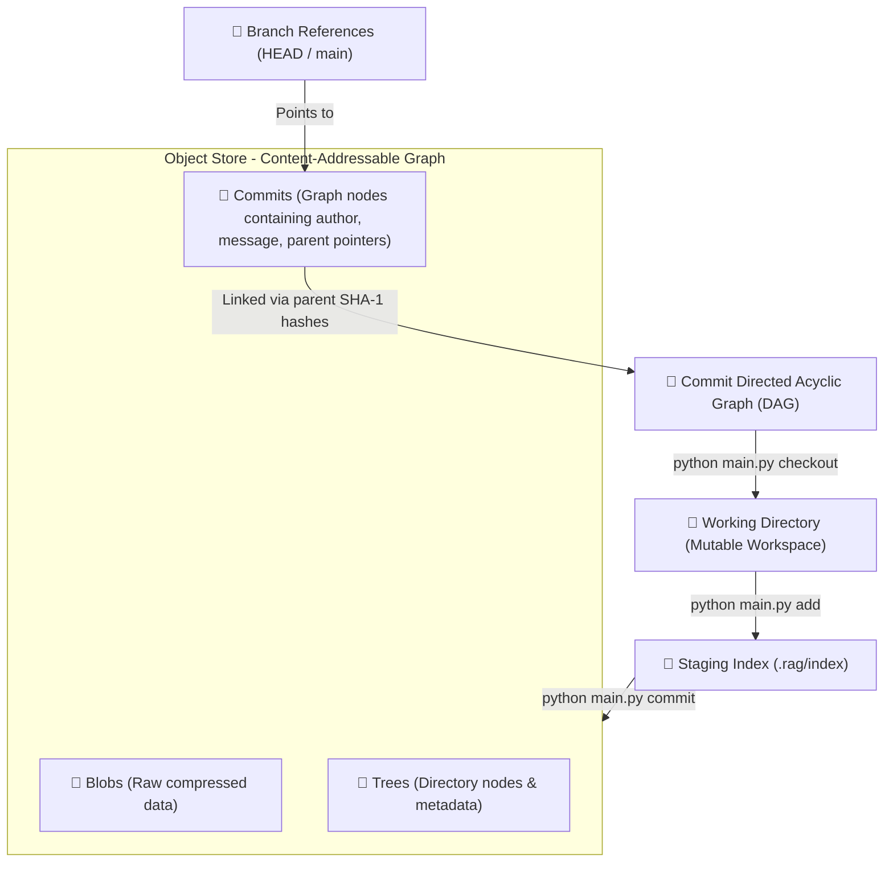

# R.A.G. — Repository Architecture & Graph Engine

[](https://www.python.org/)
[](#)
[](#)
[](#)

A pure Python, zero-dependency implementation of the Git core version control mechanics from first principles. **R.A.G.** recreates the internal workings of modern version control: content-addressable storage, a staging index, state snapshots, branch reference tracking, and a Directed Acyclic Graph (DAG) commit history.

This project is a systems-level exploration of how Git works beneath the CLI abstraction, demonstrating efficient filesystem manipulation, data serialization, hashing, and graph theory.

---

## ⚙️ Core Architecture & Concept Map

Every file tracked by R.A.G. transitions through a deterministic state machine, moving from mutable workspace files to immutable graph nodes:



### Key Subsystems:

1. **Content-Addressable Storage (CAS)**: Files are stored as objects keyed by their SHA-1 checksum. If two files have identical content, they point to the same object, optimizing storage.
2. **Object Compression**: Objects are compressed using Python's standard `zlib` compression library before writing to disk, matching production Git mechanics.
3. **Staging Area (Index)**: A state cache reflecting what _will_ be in the next commit, keeping track of path names, SHA-1 hashes, and modified times.
4. **Commit DAG Traversal**: A Directed Acyclic Graph structure allowing linear historical rollbacks (checkout) and historical log visualization.

---

## 📈 Performance & Scaling Metrics

The engine includes a benchmarking suite that measures cold-disk filesystem operations after dropping OS page caches. This shows how R.A.G. scales with repository file count:

| Repository Scale | `add` Latency | `commit` Latency | `status` Latency | `diff` Latency |
| :--------------- | :-----------: | :--------------: | :--------------: | :------------: |
| **100 Files**    |   27.92 ms    |     2.25 ms      |     11.66 ms     |    19.56 ms    |
| **500 Files**    |   127.34 ms   |     4.87 ms      |     51.74 ms     |    84.00 ms    |
| **1,000 Files**  |   268.22 ms   |     8.12 ms      |     96.70 ms     |   151.96 ms    |

### 🔍 Engineering Insights:

- **Linear Scaling on Adds**: Staging operations scale linearly $O(N)$ with the number of files since each must be read, hashed, compressed, and written to disk.
- **Constant-time Commits**: Generating a commit is extremely fast $O(1)$ relative to repo size, as it only writes tree and commit metadata objects once the index has been written.
- **Diff & Status Bottlenecks**: Computing status and diffs requires heavy disk-I/O and string operations, demonstrating the typical systems trade-off between memory footprint and execution speed.

---

## 🛠️ Feature Set

- **Repository Initialization**: Creating `.rag/` directories and initial index structures.
- **Staging Engine**: Hashing and index caching (`add`).
- **Immutable Commits**: Writing directory snapshot trees and commit metadata.
- **Branch Management**: Pointer tracking for active branch and checkout capabilities.
- **Unified Diff Engine**: Generating clear, standard diff views between staging and working directory or commits.
- **Ignore Parsing**: Honoring `.gitignore` path glob matching patterns.

---

## 💻 CLI Commands

R.A.G. is fully controllable via the command line interface:

```bash
# Initialize a new repository
python main.py init

# Stage modified/new files
python main.py add <file-path-or-dot>

# View modified files and unstaged changes
python main.py status

# Commit changes with a message
python main.py commit -m "Your commit message"

# Display commit log traversal
python main.py log

# Revert working directory to a previous state
python main.py checkout <commit-sha-or-branch>
```

---

## 💼 Skills Demonstrated

- **Low-Level Systems Programming**: Managing raw file writes, directories, hashing (`hashlib`), and compression (`zlib`) without framework overhead.
- **Data Structure Design**: Building tree structures, staging schemas, and managing serialization of metadata.
- **Graph Theory**: Traversing a Directed Acyclic Graph to reconstruct historical states and resolve parents/commits.
- **Performance Diagnostics**: Writing benchmarks to measure system limits, disk-I/O speed, and execution times under stress.
